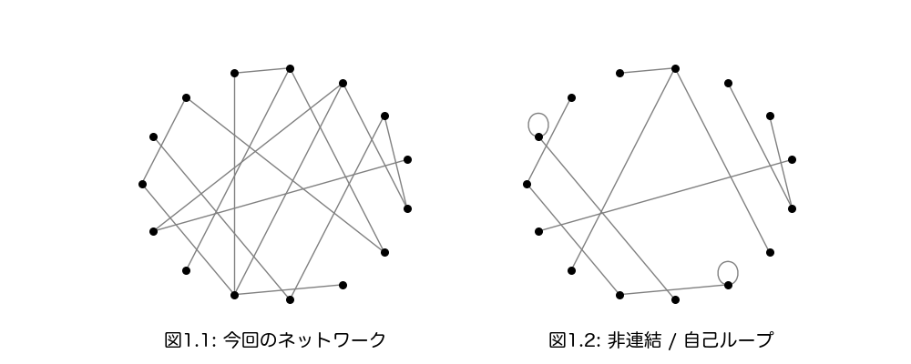

# 理想の人口規模
人のつながりがある社会/集団は、どのくらいの人口規模まで可能だろうか。

## 概要
人の集団にはさまざまある。小さなコミュニティから会社、村や街、そして国など。
たとえば街といっても、数千人のところから数十万人のところもあり様々であるが、それは多様な差異を生み出す。
ここでは理想的な集団を次のように定義する。
「任意の2人の構成員は直接の知人であるか、もしくは共通の知人がいること。」
知人が話す知人の話であれば関心を持つだろうということで、すべての人々が互いに関心を持ちうる集団となっている。
つまり、集団の規模と、構成員が互いに知人か否かにだけ着目して、分析をしていく。
モデル化にはネットワーク理論を用いる。
集団の構成員をノード、知人であるかをノード間のエッジの有無で表す。
すると、理想の集団はノード間距離が2以下と表される。
モデルにはConfigurationモデルを用い、知人数(エッジ数)はLognormal分布からサンプリングする。
Lognormal分布にはheavy-tailedな性質があるので、hub(知人数の多い人)が存在することになり、人の集まりを考える上では妥当な性質と思われる。
このモデルを使って、全ノード数とノード間距離の関係を数値的に求めた。
すると、集団規模が数万人程度までであればノード間距離が約2以下となり、おおよそ任意の2人は直接の知人であるか共通の知人をもつことがわかった。

## はじめに
人の集団にはさまざまある。小さなコミュニティから会社、村や街、そして国など。
そして、各々の規模は実に多様で、例えば数百人の街があれば数百万人の街もあり、それは多様な差異を生み出す。

古来から理想的な都市や国家の人口規模について論じられてきた。
プラトンの『法律』では、市民すべてが互いに知り合いであるような国家を理想とし、5040人の人口が適正だと主張した。
ルソーは『社会契約論』で、主権者と国家の関係を人口規模の点で論じた。
マルサスは『人口論』で食料と人口の関係について論じた。
より具体的にダールとタフティは『規模とデモクラシー』で、実際の国や自治体の統計データを使って人口規模とデモクラシーについて論じている。

ここでは人々の関係性について考えたい。
たとえば、人口規模の大きすぎる街や都市だと、見知らぬ人であふれ関係性は希薄になるが、どれくらい規模を小さくすれば人々の関係性を回復することができるだろう。
もしくは、小さなコミュニティでは密な人間関係があるが、どこまでその関係性を維持しながら規模を大きくできるだろう。

問題を簡単にして、コミュニティや街といった特定の集団ではなく、人数だけ与えられた一般的な人の集団を考える。
そして、理想的な集団を次のように定める。  
$$同じ集団の任意の2人は、直接の知人であるか、共通の知人をもつ。 \tag{1}$$
知人の知人までは関心が及ぶだろうということで、このように定めた。
知人の知人の話はよく耳にするし関心を持ちうるが、知人の知人の知人の話はあまり聞かないし関心も持てないだろう。
つまり、すべての構成員が互いに関心が及ぶような集団を理想としてみる。
このような集団では、匿名性が弱く噂話の類は瞬く間に広がるので、利己的な行動をとることは難しい。
裏を返せば、同じ集団の誰に対しても、その存在をありありと感じることができ、同じ共同体を生きているという実感を持つことができる。
それは他者を気にかけ共同体を重んじる意識をつくるだろう。
そして、その規模についてここでは考えていく。

つまりこのように問題を単純化して、 $(1)$ が成り立つような理想的な集団について、その人口規模の上限をここでは探っていきたい。
次の章では、その数学的なモデル化を行う。

## モデル
モデル化にネットワーク理論を用いる。
ネットワークは人を表すノード(点)の集まりと、ノードをつなぐエッジ(線)からなる。
ある2つのノードにエッジが存在するときは、彼らは互いに知人ということにする。

いくつか注意点を述べる。
- 一方的に知人であることは考慮しないので、エッジに向きはない(無向)。
- また、集団の中に孤立した別の集団は考えないので、どの2つのノードを選んでも、一方のノードからエッジをつないでいくことで必ずもう一方のノードに辿り着けることにする(連結)。
- 自分自身と知人にならないように、同じノードへのエッジ、つまり自己ループは存在しないことにする。

ノードは人に、エッジは知人関係であることに対応することで、ネットワークは人の集団を表すことになる。

### Hubの存在
あるノード $i$ につながっているエッジの本数のことを、次数 $k_i$ とよぶ。

つまり、ある人 $i$ には $k_i$ 人の知人がいることを表す(知人数=次数)。  
さて、知人の数は人によってさまざまだが、その確率分布はLogNormal分布(連続確率分布)に従うことが報告されている[1]。  
Lognormal分布  
$$p(x, \mu, \sigma) := \frac{1}{\sqrt{2\pi} \sigma} \frac{1}{x} \exp{[-\frac{1}{2}\{\frac{(\log{x}) - \mu}{\sigma}\}^2]}$$  
- $x$：確率変数
- $\mu$, $\sigma$：パラメータ
- $x$ の最頻値： $\exp{(\mu - \sigma^2)}$
- 連続確率分布だが、次数は非負の整数なのでサンプリング時は離散値に近似する。 

  
実際に一人ひとりに知人の数を数えてもらうことは難しいので、この報告では指定した苗字の知人数だけをまず数えてもらう。
そして、すべての苗字の中でその苗字が占める割合によって全体の知人数を推定し、それがLognormal分布に従うことが示されている。

この分布はheavy-tailedという特徴的な性質をもつ。
たとえば最も一般的に知られている正規分布 $p(x) \sim e^{-x^2}$ は指数関数的に減少するが、Lognormal分布はよりゆっくりと減少するので、右に裾がのびている(図3)。
それをheavy-tailedとよぶ。
すると、知人数の多い人(図3では1000人あたり)がそれなりに存在し、彼らをネットワーク理論では「Hub」とよぶ[6]。
知人がとても多い、顔の広い人はどの集団にもいるので、Lognormal分布は知人数の分布として理にかなっていると思われる。
今回はこの分布を使っていく。

次の項から知人数の平均値ではなく最頻値を考えるが、それはLognormal分布がhevy-tailedな性質をもつため、最頻値よりも平均値がずっと大きいためである。
正規分布の場合は最頻値と平均値は一致する。

### 確率分布のパラメータ推定
知人の知人までは関心が及ぶだろうということで $(1)$ を理想の条件としたが、[1]の報告では知人数の最頻値が約310人 ( $\mu = 6.2$ , $\sigma = 0.68$ )で、その数は大きすぎるように感じる。
[1]の知人よりも距離の近い知人を考えていきたい。
Facebookの友人数のデータ[2]によると、友人数の最頻値は約98人で、今回はこのデータを採用する([facebook-friends.ipynb](facebook-friends.ipynb) でデータ[2]を整え算出した)。
Lognormal分布のパラメータ推定(尤度推定)を行うと $\mu ≒ 5.60$, $\sigma≒1.00$ となり、下図のようによくfitしている([facebook-friends.ipynb](facebook-friends.ipynb))。

  
このパラーメータのLognormal分布を用いて、次の項からネットワークを作っていく。

### Configurationモデル
分析に使う具体的なモデルの作り方を説明する。
まず、ネットワークの全ノード数 $N$ (集団の人数)を決める。
次に先程のLognormal分布から $N$ 個サンプリングすることで、知人数の最頻値が先程の約98人となる $N$ 人の集団を用意する。
そして、各ノードがサンプリングした知人数をもつように、うまい具合に誰と誰が知人かを決めることでネットワークを作る。
これはConfigurationモデルとよばれ、より詳しいアルゴリズムは[3]にある。  

ただし、今回は友人数が1000人より多いサンプルは棄却し、サンプリングし直すことにする。 $(1)$ のようにお互いに関心が及ぶ集団を考えているので、あまりに知人数が多い人は除く[4]。

### ノード間距離
ノード間の距離を定める。
あるノード $i$ から別のノード $j$ にたどり着くまでに通らなければならない最小のエッジ数を、ノード間距離 $l_{ij}$ とよぶ：
$$l_{ij} := 「i とjの間にある最小のエッジ数」$$

例えば、直接の知人であれば $l_{jp}=1$、直接の知人ではなく共通の知人がいると $l_{kn}=2$ となる。

そして、ノード間距離をネットワークのすべてのノードの組み合わせで平均したものを、ネットワークの平均ノード間距離 $L$ と定義する：
$$L := \frac{1}{N} \sum_{(i,j)}\ l_{ij}$$
和 $\sum$ は、ネットワークのすべてのノードの組み合わせでとる。
すると、理想の集団の条件を $(1)$ と定めたが、それは $L \le 2$ と定式化される。

## 数値計算 / 分析結果
上記のモデルを使って、全ノード数 $N$ とノード間距離 $L$ の関係を数値的に調べる。
具体的には、全ノード数 $N$ を決め、Lognormal分布から $N$ 個サンプリングし、Configuraritionモデルをつくる。
そして、ノード間距離 $L$ を数値計算する。
ソースコードは [network-length.py](network-length.py) にある。
その結果が下の図になる。  

  

丸印が実際に数値計算した値で、丸印をつなぐ直線はそれらの補完である。
$N=8000$ で $L≒2$ となり理想の集団の上限に最も近い。
また、図6-2から $N=10^4$ のオーダーまで $L$ は $2$ に近く、 $N=10^5$ のオーダーだと $L$ は $3$ に近いことが予想される。
(計算環境の都合により $N$ が6万以上の場合は計算していない [5]。)

よって、数万人程度の規模までであれば、平均距離ノード間距離が約2に収まり、全員が互いに直接の知人であるか共通の知人をもつことがわかった。

## 参考文献と補足
1. Tyler H. McCormick, Matthew J. Salganik & Tian Zheng (2010) How Many People Do You Know?: Efficiently Estimating Personal Network Size, Journal of the American Statistical Association, 105:489, 59-70.
2. https://www.kaggle.com/datasets/sheenabatra/facebook-data
3. Newman, M. E., Strogatz, S. H., & Watts, D. J. (2001). Random graphs with arbitrary degree distributions and their applications. Physical review E, 64(2), 026118.
4. かなり人為的なcutoffのため、改善の余地がある。たとえば、Lognormal分布のような連続分布ではなく、有限のsupportをもつ離散分布を使ったり、facebookデータではない現実の友人数のデータにfitする別の分布を使うなど。
5. 参考までに、今回は `Intel Core i5-6360U` の1CPUで実行した。$N=60,000$ で16時間ほど、平均距離ノード間距離の算出に時間を要した。
- このRepositoryを作るためのソースコードはすべてここに載せている。また、ソースコードを実行するのに必要なライブラリはPythonの基本的なライブラリと、[NetworkX](https://networkx.org/) だけである。バージョンについては、Python(3.11.0)、NetworkX(3.2.1)を用いた。
- [node-distance.csv](node-distance.csv) は、図6を出力するための数値データ。[network-length.py](network-length.py) を実行することで得られる。
- [images-for-readme.ipynb](images-for-readme.ipynb) は、この `README.md` で使われた図を作るソースコード。
- スモールワールド性について。スモールワールドはネットワーク理論において最重要な性質であるが、図7-2が直線( $L \sim \log N$) であればその性質を満たす。
6. スケールフリー性について。スケールフリーはネットワーク理論においてスモールワールドに並ぶ最重要な性質であるが、今回はLognormal分布を用いたのでその性質はない。ただ、スケールフリーなネットワークは「Hub」をもち、今回のモデルでも「Hub」を有する。
- 最後になるが、今回は数値計算だけの調査だったので、今後、解析的にも主張ができたらと思う。つまり、このような知人数についてのConfigurationモデルがHubをもち、スモールワールド性をもつことを解析的に示したい。
